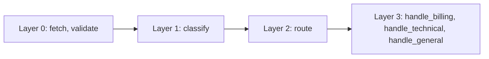

# Architecture

AgentLoom is a **deterministic workflow orchestrator** — not an autonomous agent framework. You define the DAG, the engine executes it.

## Overview

```
+-----------------------------------------------------+
|                   CLI / Python API                  |
+-----------------------------------------------------+
|                   Workflow Engine                   |
|  +-----------+  +-----------+  +---------------+    |
|  |DAG Parser |  | Scheduler |  | State Manager |    |
|  |& Validator|  |  (anyio)  |  |  (Pydantic)   |    |
|  +-----------+  +-----------+  +---------------+    |
+-----------------------------------------------------+
|                   Step Executors                    |
|  +--------+ +---------+ +------+ +------------+     |
|  |LLM Call| |Tool Exec| |Router| | Subworkflow|     |
|  +--------+ +---------+ +------+ +------------+     |
+-----------------------------------------------------+
|                  Provider Gateway                   |
|  +-----------------------------------------------+  |
|  | OpenAI | Anthropic | Google | Ollama          |  |
|  | + Fallback | Circuit Breaker | Rate Limiter   |  |
|  +-----------------------------------------------+  |
+-----------------------------------------------------+
|              Observability (optional)               |
|  +------------+  +----------+  +----------+         |
|  | OTel Traces|  |Prometheus|  | JSON Logs|         |
|  +------------+  +----------+  +----------+         |
+-----------------------------------------------------+
```

## Execution flow

The engine processes a workflow in five phases:

### 1. DAG construction

The parser reads the YAML (or Python DSL output) and builds a directed acyclic graph from step definitions and their `depends_on` fields. Cycle detection runs at parse time — circular dependencies are rejected before execution starts.

### 2. Layer extraction

Topological sort groups steps into **execution layers**. Each layer contains steps with no inter-dependencies, meaning they can run in parallel.



### 3. Parallel execution

For each layer, the engine:

1. Filters active steps (skips those blocked by router decisions)
2. Launches concurrent tasks via `anyio` task groups (up to `max_concurrent_steps`)
3. Waits for the layer to complete before advancing

### 4. Router handling

Router steps evaluate conditions against the current state and output a target step ID. Downstream steps not activated by the router are marked as **skipped** — they never execute.

### 5. Result aggregation

After all layers complete, the engine collects step results and computes totals (tokens, cost, duration). The final workflow status is `SUCCESS` if all steps passed, `FAILED` if any step failed, `TIMEOUT` if the deadline was exceeded, or `BUDGET_EXCEEDED` if the cost limit was hit.

## Result models

### WorkflowResult

Returned by `engine.run()` after workflow execution completes:

| Field | Type | Description |
|-------|------|-------------|
| `workflow_name` | `str` | Workflow identifier |
| `status` | `WorkflowStatus` | `success`, `failed`, `timeout`, or `budget_exceeded` |
| `step_results` | `dict[str, StepResult]` | All step outputs and metadata |
| `final_state` | `dict[str, Any]` | State snapshot after completion |
| `total_duration_ms` | `float` | Total wall-clock time |
| `total_tokens` | `int` | Sum of all tokens consumed |
| `total_cost_usd` | `float` | Estimated total cost |
| `error` | `str | None` | First failure message, if any |

### StepResult

Metadata and output for each individual step:

| Field | Type | Description |
|-------|------|-------------|
| `step_id` | `str` | Step identifier |
| `status` | `StepStatus` | `pending`, `running`, `success`, `failed`, `skipped`, or `timeout` |
| `output` | `Any` | Step output value |
| `error` | `str | None` | Failure reason |
| `duration_ms` | `float` | Step execution time |
| `token_usage` | `TokenUsage` | Prompt, completion, and total tokens |
| `cost_usd` | `float` | Estimated step cost |
| `model` | `str | None` | Model used (LLM steps) |
| `provider` | `str | None` | Provider name |
| `attachment_count` | `int` | Multi-modal attachment count |
| `time_to_first_token_ms` | `float | None` | TTFT for streaming steps |

## State management

The `StateManager` provides async-safe shared state with dotted-key access:

```python
state["user.profile.email"]    # nested access
state["items[0].name"]         # array indexing
```

- All steps in a workflow share the same state instance
- Steps with `output: key` write their result to `state[key]`
- Templates use `{state.key}` or `{key}` (flat namespace) for interpolation
- State is implemented with Pydantic models for validation

## Provider gateway

The gateway routes requests based on model name and manages resilience:

| Feature | Description |
|---------|-------------|
| **Fallback** | Providers are tried in priority order. If one fails, the next is attempted automatically |
| **Circuit breaker** | After 5 consecutive failures, a provider is taken offline for 60 seconds |
| **Rate limiter** | Token-bucket algorithm enforces requests/minute and tokens/minute limits |

See [Providers](providers.md) for provider-specific details.

## Design principles

!!! tip "Why not autonomous agents?"

    Most LLM frameworks focus on autonomous agents with self-directed reasoning and unbounded tool loops. This works for demos but breaks in production where you need predictable costs, debuggable failures, and SLA compliance.

    AgentLoom takes a different approach:

    - **You define the DAG, not the LLM.** The model generates text within a step — it does not decide what runs next.
    - **Observability is not optional.** Every step emits traces and metrics.
    - **Cost is bounded.** Budget limits and circuit breakers are first-class.
    - **Fallback is structural.** Provider routing happens at the infrastructure level, not via agent "choice."
